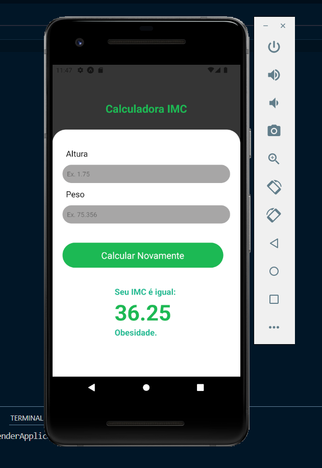

# Calculo de IMC - React Native - Harison Rios 💻

>  Page - Imagem 1

>  Page - Imagem 2

## Tecnologias

React Native

Expo
 
## 📝 Licença

Esse projeto está sob licença. Veja o arquivo [LICENÇA](LICENSE.md) para mais detalhes.
